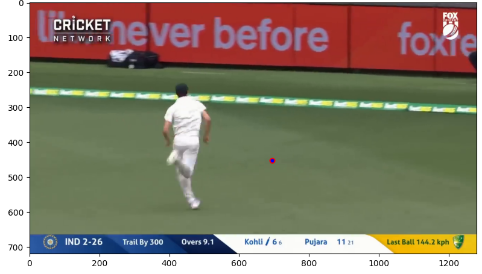

# Color-Based Sports Ball Tracker
>  Mar 2026 | OpenCV, NumPy

## Problem Statement
Detect and track a sports ball in broadcast video 
using classical computer vision techniques.

## Demo

## Pipeline
Frame → Blur → BGR→HSV → Mask → Morphology → 
Contours → Centroid → Draw

## Architecture
| Step | Technique | Function |
|------|-----------|----------|
| Color conversion | BGR → HSV | cv2.cvtColor |
| Masking | HSV inRange | cv2.inRange |
| Noise removal | Morphological opening | cv2.erode + dilate |
| Detection | Contour finding | cv2.findContours |
| Localization | Moments | cv2.moments |

## HSV Calibration
| Ball | H range | S min | V min |
|------|---------|-------|-------|
| Tennis | 22–42 | 150 | 100 |
| Cricket (red) | 0–25, 165–179 | 40 | 60 |

## Results
- Tennis ball: Clean detection on dark background
- Cricket ball: Partial detection, limited by broadcast footage

## Known Limitations
- Red hoardings cause false positives in cricket footage
- Ball too small at broadcast distance (<10px radius)
- HSV values shift with lighting and camera distance
- Scene cuts cause calibration drift

## Usage
Open notebook/CV_Project3_Ball_Tracker.ipynb in Google Colab

## What I Learned
See LEARNING.md

## Future Work
- YOLOv8 for robust ball detection
- CSRT tracker for occlusion handling
- Multi-camera support
